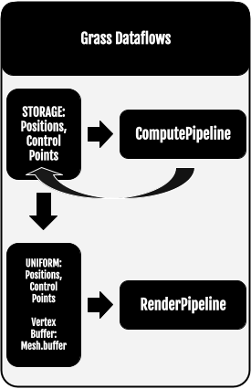
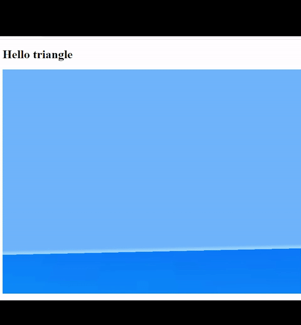
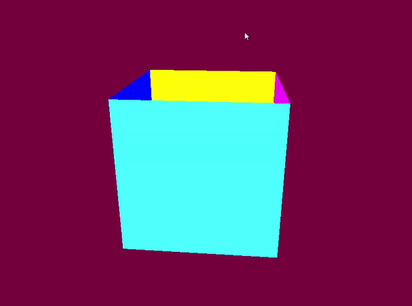

WebGPU Non-PBR Renderer
==================================

**University of Pennsylvania, CIS 565: GPU Programming and Architecture, Project 5**

* Constance Wang
  * https://www.linkedin.com/in/conswang/

* Eyad Almoamen
  * https://www.linkedin.com/in/eyadalmoamen/
  * https://eyadnabeel.com/
 
* Edward Zhang
  * https://www.linkedin.com/in/edwardjczhang/
  * https://zedward23.github.io/personal_Website/  
 
* Tested on: Windows 10 Home, i7-11800H @ 2.3GHz, 16.0GB, NVIDIA GeForce RTX 3060 Laptop GPU

Overview
==================================

This project attempts to:
1. Provide a WebGPU implementation of a non-photorealistic renderer. This will be done by implementing the non-PBR shaders as described in this article: [Blender NPR: Recreating the Genshin Impact Shader](https://www.artstation.com/blogs/bjayers/9oOD/blender-npr-recreating-the-genshin-impact-shader) using vertex and fragment shaders
2. Enrichen the ecosystem of compute shader applications in WebGPU by rendering real-time grass according to this paper: [Responsive Real-Time Grass Rendering for General 3D Scenes](https://www.cg.tuwien.ac.at/research/publications/2017/JAHRMANN-2017-RRTG/JAHRMANN-2017-RRTG-draft.pdf)

See the site live on [webgpu-impact.vercel.app](https://webgpu-impact.vercel.app/).

Final Presentation Slide Deck:
https://docs.google.com/presentation/d/1uKtEbVWBox0gDw1JbSN3blPA3Bx38DJ2Qxx1-XZ1H8s/edit?usp=sharing

Installation
==================================
`webgpu-impact` is built with [Typescript](https://www.typescriptlang.org/)
and compiled using [Next.js](https://nextjs.org/). Building the project
requires an installation of [Node.js](https://nodejs.org/en/).

- Clone this repo
- Install dependencies: `npm install`.
- To run and build, oepn console to run 'npm run dev'
- Can only be viewed in Google Chrome Canary or Chrome Developer
- Make sure to '--enable-unsafe-webgpu' in Chrome Settings

Compute Pipeline
==================================
Grass Parameters: Forces, control points, stem positions

Grass in the scene are defined as simple triangles; one vertex of that triangle also serves as the control point that the forces in the scene will act on when animated.

### Performance

We measured the performance of our compute pipeline relative to the number of blades of grass.

| Number of grass blades | Frames per second, averaged over 10 seconds |
| ----------- | ----------- |
| 500 | 240 |
| 1000 | 240 |
| 2000 | 37 |
| 5000 | 35 |
| 10000 | 19 |

Render Pipeline
==================================
UV textured primitive with posterize shader:  

Grass Instance Rendering

Grass with recovery forces:  

**The remaining features are all in the MergeAttempt Branch**

Interactive Camera
==================================

Quaternion-based interactive camera controlled by keys. (WASD for translation, Arrow Keys for Rotation)

Sky Box 
==================================

6 textured planes that enclose the interactive camera eye position.

Compute Clouds
==================================

The noise and density approximations for clouds are calculated in a compute shader, written to a texture, and then that texture is drawn to the top face os the skybox
Proposed future implementation of raymarched clouds integrated into a rasterized scene: [link](https://docs.google.com/document/d/17y9POT-lSiN-K3quoQ_PVPrY3xxe-jweNk1Djiy5Xfk/edit?usp=share_link).

Future Direction
==================================
- Animation & Skinning
- Improved Camera Functionality
- GLTF Loading

Bloopers
==================================
Depth buffer fail  

